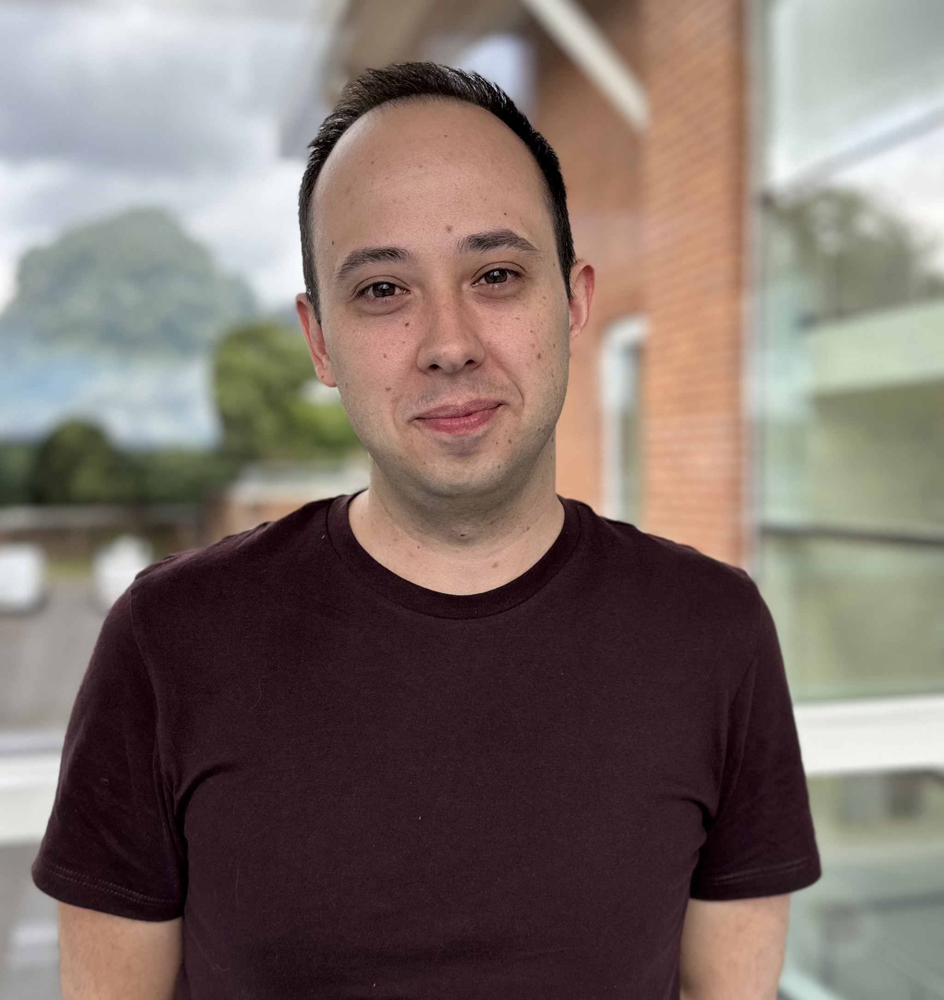

Fabio’s core research interest is in the use of models of disease to unravel pathological mechanisms that underpin disease phenotypes, with a view to uncovering and testing novel targets for therapeutic intervention. In 2017, he completed his PhD at Brighton and Sussex Medical School (BSMS), focusing on the role of molecular motors and the cytoskeleton in the selective vulnerability of motor neurons to degeneration in motor neuron diseases. In his first postdoctoral position at the University of Sussex, he created a novel model to investigate whether reduced function of an important molecular motor could increase susceptibility to motor neuron disease. He then returned to BSMS for a second postdoctoral position in which he utilized a surgical model of osteoarthritis to test the effectiveness of a novel potential therapy. He now aims to leverage his decade of experience in using *in vivo* models, and his broad molecular biology experience, to investigate the role of the tumour microenvironment in haematological malignancies such as Acute Myeloid Leukaemia (AML). His goal is to identify novel approaches to make tumour cells more vulnerable to therapies.

