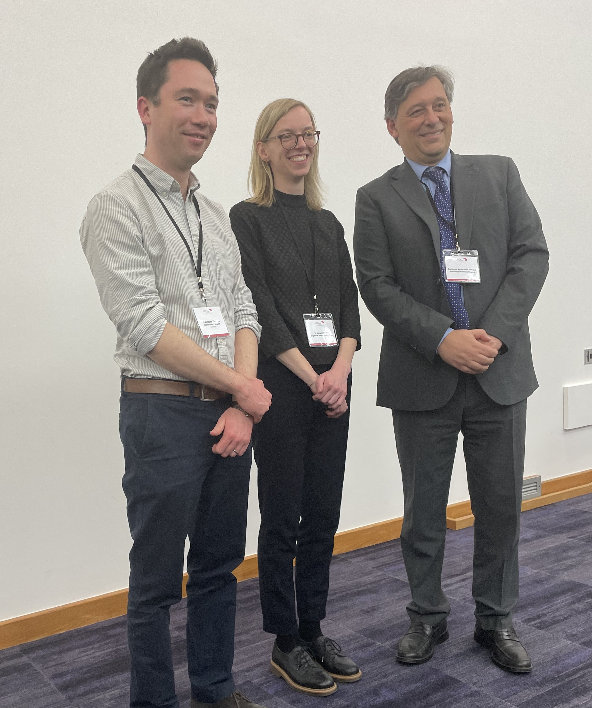
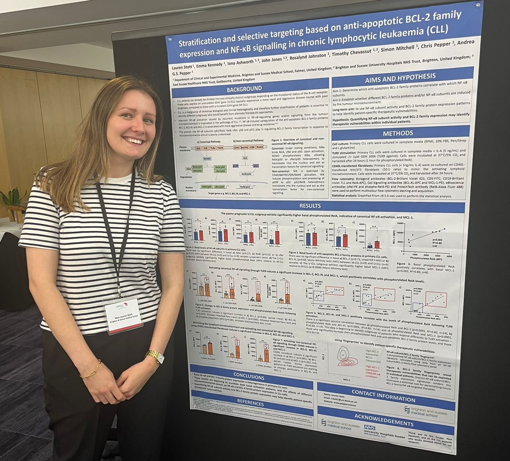
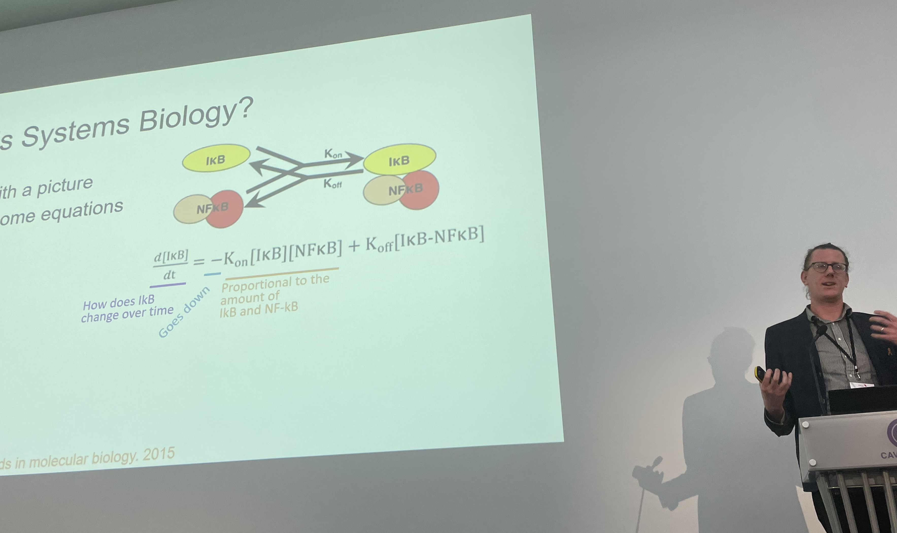

On Friday 8th March the UKCLL Forum annual scientific day (https://ukcllforum.org) was held in London and attended by members of the Pepper/Mitchell team. Dr. Simon Mitchell (https://mitchell.science)

The day concluded with the award of the Catovsky prize; an award established in 2006 by the UK CLL Forum in recognition of the outstanding contribution that Professor Daniel Catovsky made to the field of clinical and scientific CLL research. All non-tenured UK CLL researchers are invited to submit an abstract of their research work for consideration by the UK CLL Forum Executive committee. The highest scoring abstracts were selected for a 15-minute oral presentation at the meeting and the remainder invited to present their work as a 3-minute flash presentation and a poster. A panel then selects two winning applicants based on their oral and poster presentations. This year it was a clean sweep for the BSMS Pepper/Mitchell team. Dr Iona Ashworth won the oral presentation (jointly with Dr Matthew Timmis from the University of Cambridge) for her research entitled ‘Targeting NF-κB-inducing kinase (NIK) in chronic lymphocytic leukaemia’, and Lauren Stott won the poster prize on her research entitled ‘Stratification and selective targeting based on anti-apoptotic Bcl-2 family expression and NF-κB signalling in chronic lymphocytic leukaemia (CLL)’.

