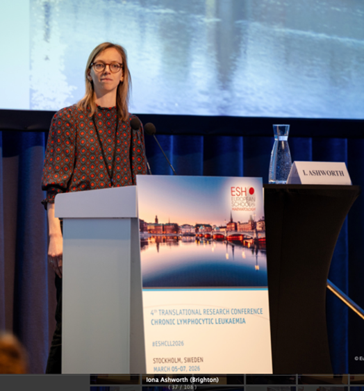
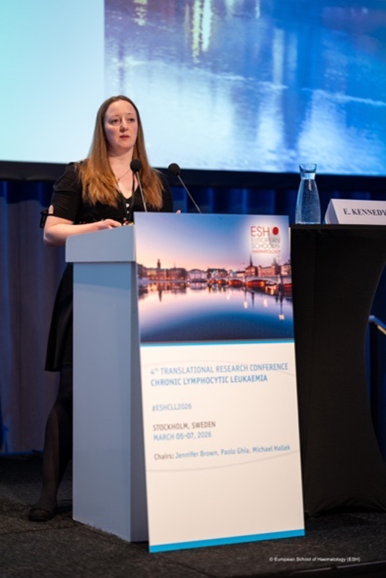
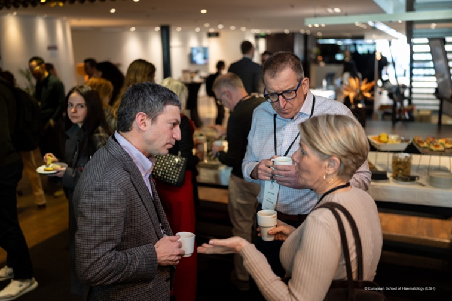

## Overview

Members of the Blood Cancer Research Group from BSMS attended the 4th translational conference on Chronic Lymphocytic Leukaemia held in Stockholm, Sweden. This prestigious international meeting brought together world-leading researchers and clinicians to discuss advances in the biology and treatment of CLL. Only 6 abstracts from a competitive field were selected for oral presentations, and the team were delighted that both of their abstracts were chosen.  

## Oral Presentation

**Targeting non-canonical NF-κB signalling in Richter Transformation: Rationale for NIK inhibition as a microenvironment-directed therapeutic strategy.**

*Presenter:* *Dr* *Iona* *Ashworth* 

Iona described how the lymph node microenvironment promotes drug resistance via activation of canonical and non-canonical NF-κB pathways. Inhibiting NF-κB-inducing kinase (NIK) suppressed survival signals, reduced anti-apoptotic BCL2-family protein expression, and restored sensitivity to venetoclax. NIK inhibition also impaired CLL cell migration and showed synergy with venetoclax in both primary CLL and Richter’s models—supporting clinical development of NIK inhibitors to overcome microenvironment-driven resistance. 

**TLR9-dependent migration defines chronic lymphocytic leukemia subgroups and their response to BTK inhibitor monotherapy**

*Presenter:* *Dr* *Emma* *Kennedy*

Emma’s presentation described TLR9 signalling as a mechanism of resistance to BTK inhibitors such as ibrutinib. Using primary patient samples and migration assays, she identified subsets of CLL cases in which TLR9 activation enhanced cell migration even in the presence of BTK inhibition, suggesting a potential BTK-independent survival pathway. The study also linked TLR9 responsiveness with disease aggressiveness, proposing TLR9 induced migration as a biomarker for identifying patients who will respond best to BTKi monotherapy.

## Networking

The ESH meeting was a fantastic opportunity for us to showcase our research with international experts and collaborators in the field as well as listen to presentations on all the exciting research going on in CLL. We were particularly interested in the important research on drug resistance in CLL and insights into the challenges in finding effective therapies for Richter’s transformation. For Iona and Emma, it was an invaluable experience to present their work at a major international meeting and they both had excellent feedback.

Once again, we are grateful to the UK CLL Forum for their generous financial support, which helped us to participate in this fantastic meeting. 

