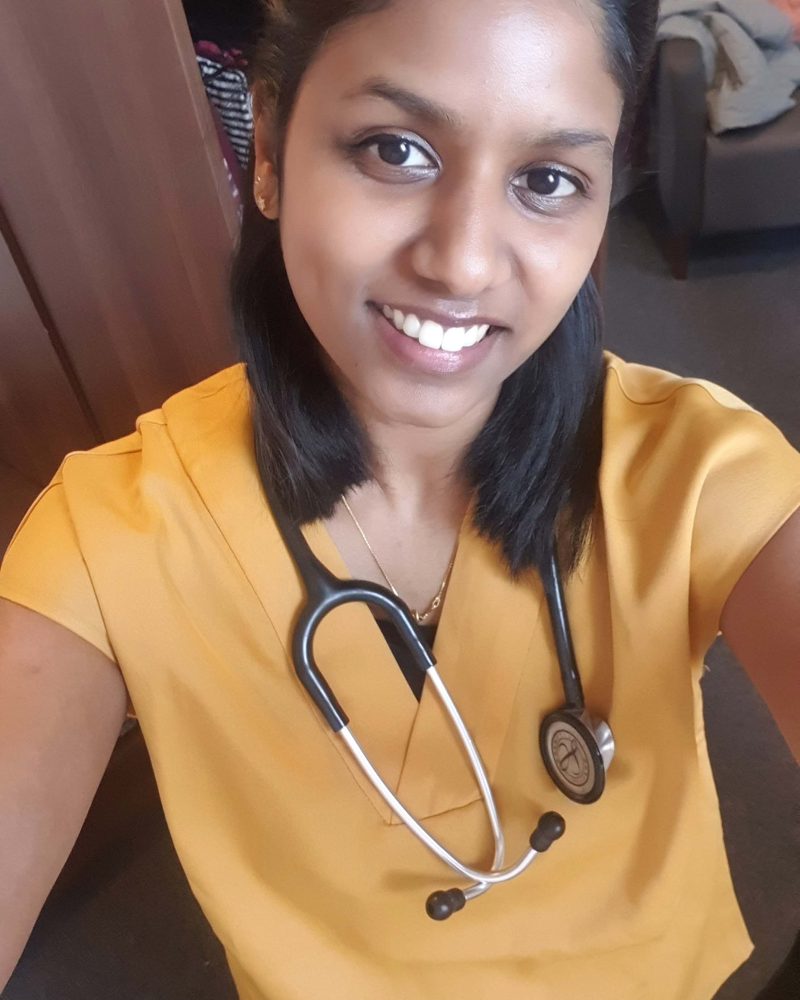

Elaina’s project was an exciting collaboration with Professor Helfrid Hochegger who is the head of cell cycle control in the genome damage and stability centre (GDSC, University of Sussex). In her project Elaina worked on a novel inhibitor of a cell cycle protein called Greatwall, which had been developed by Prof. Hochegger. She was able to show that the inhibitor was able to both inhibit cell cycle (proliferation) and kill blood cancer cells. Furthermore, it preferentially killed the blood cancer cells over the patient’s normal blood cells. 

