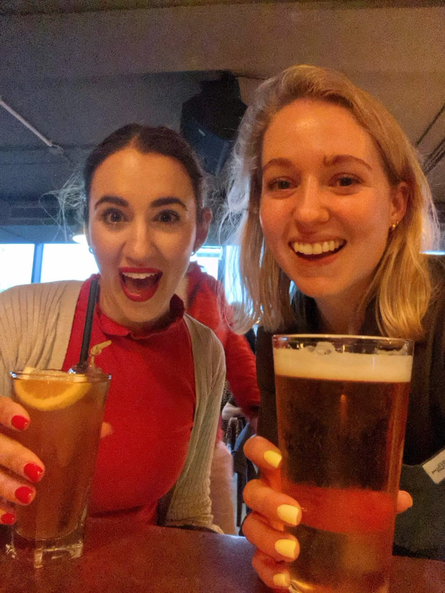

Eleni had her viva in October and Kim had hers in January. Both did brilliantly and had just minor corrections, which they have already completed. Eleni then had just two days to unwind before giving birth to a beautiful baby boy named George. She will be returning to clinical medicine after her maternity leave, but we are delighted that she will remain a member of our research team.  She has already secured grant funding from the Sussex Cancer Fund for a PhD studentship to work on a follow-on project from her PhD. She will be supervising this as the principal investigator helped by the two co-investigators Prof. Andrea Pepper and Dr Fabio Simoes. 

Kim has moved back to her home town near Oxford. She has secured a post-doctoral research position at Oxford University and will be working there until the summer when she will set off on her travels across the USA. On her return she plans to continue as a researcher, and we would love to have her back in BSMS! 

