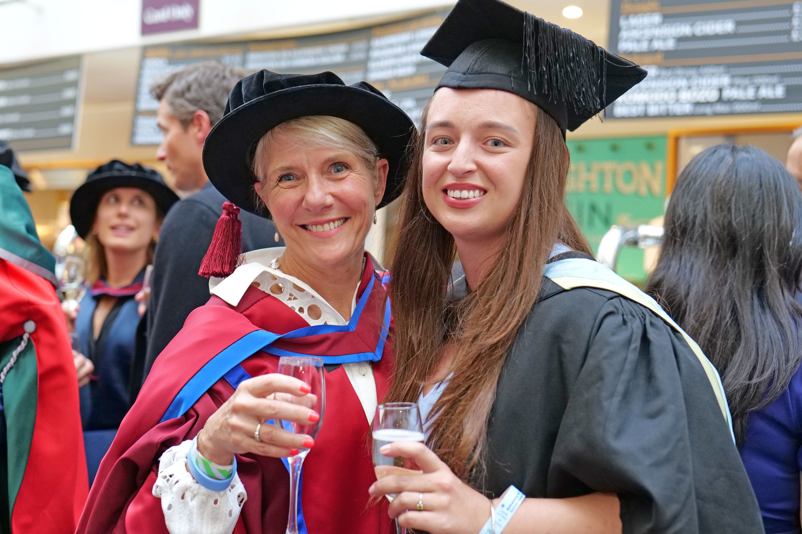

Emma graduated from BSMS in July 2024 achieving distinctions in years 3,4 and 5 OSCEs and an award for the greatest contribution to the community. It was lovely for Chris and Andrea to be part of Emma’s graduation ceremony and we are looking forward to her coming back to our research labs having been accepted on the Kent Sussex Surrey and Wessex specialised foundation programme as junior doctor. 

