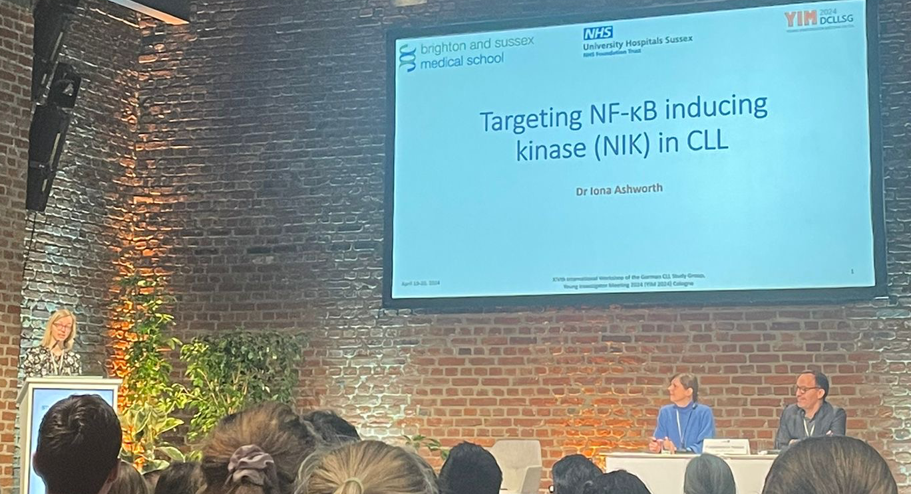
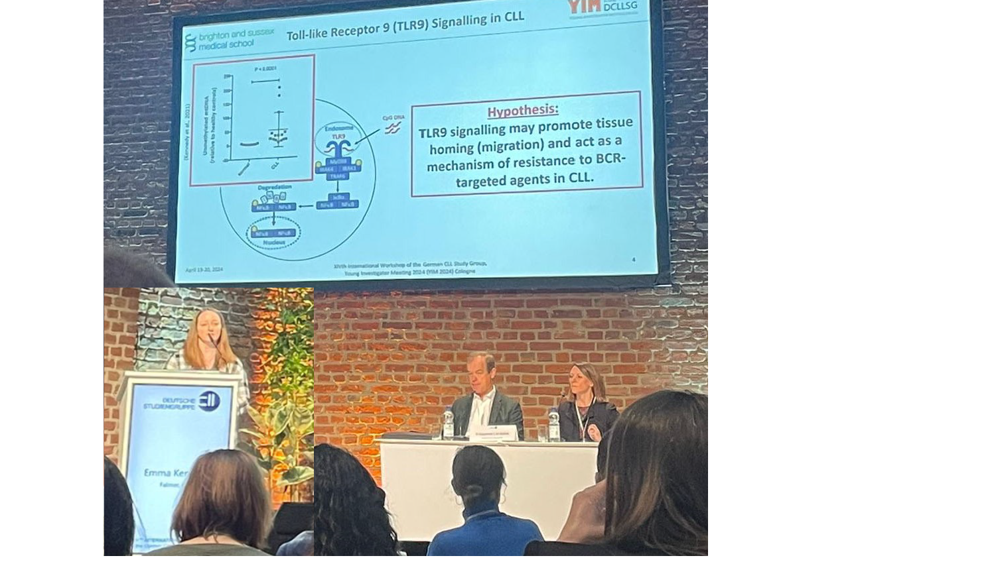
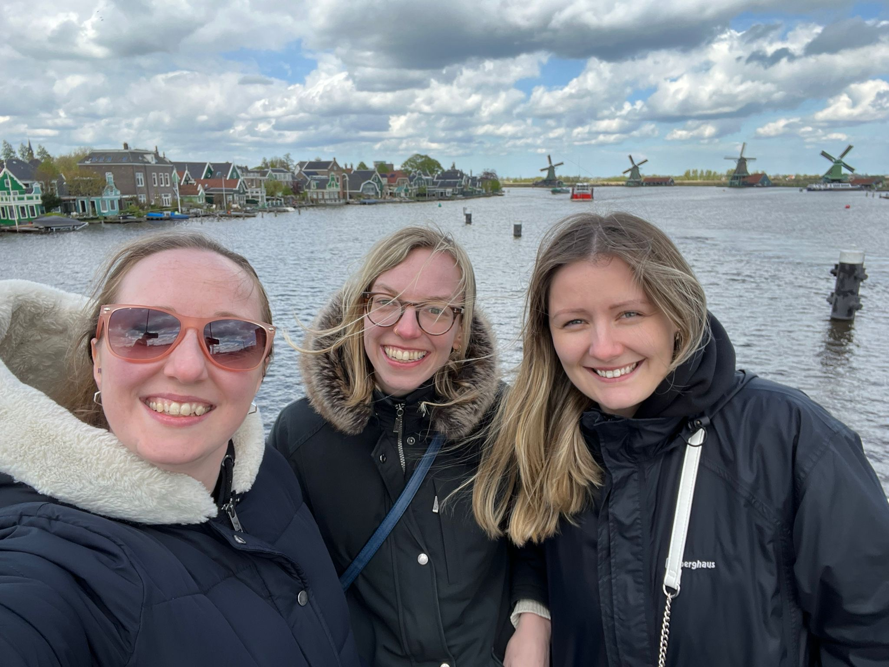

It was a fantastic meeting and all three came back with notebooks full of interesting information that they learned. Both Iona and Emma received travel fellowships as they were invited to present their research data; both of their talks generated a lot of interest with plenty of questions and useful suggestions.

After the meeting, they took a few days holiday to see the sights of Cologne and then Amsterdam.

