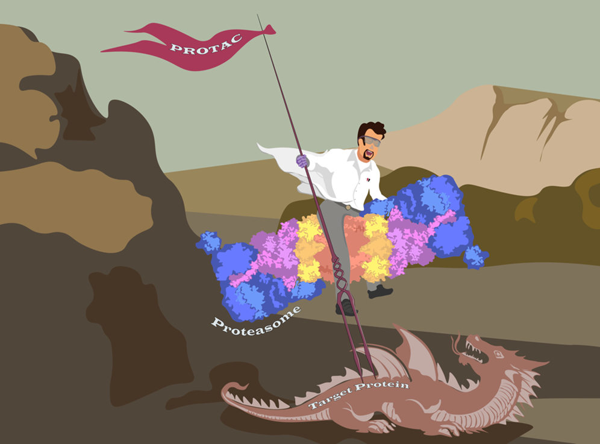
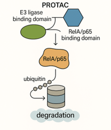

This prize is awarded for the best publication in the field of Chronic Lymphocytic Leukaemia (CLL) by a UK based research team and it is the second time that the team lead by Chris and Andrea have won as Emma Kennedy won in 2021.  The exciting paper was published in RSC Medicinal Chemistry and the whole team are delighted that Peiqin’s cartoon image of his project has been chosen for the front cover of the journal:

 The project is the result of a very successful collaboration between Chris and Professor Miraz Rahman, a Professor of Medicinal Chemistry in the School of Cancer and Pharmaceutical Sciences at King's College London. It describles how a novel drug, a C8-linked pyrrolobenzodiazepine (PBD) containing proteolysis-targeting chimera (PROTAC), can selectively degrade a protein called RelA/p65 which is an important component of the NF-κB signalling: 

NF-κB signalling is known to play a major role in helping cancer cells, including CLL, to survive and proliferate. Degrading RelA/p65 will reduce NF-κB signalling and promote tumour cell death. Although this is not the first attempt at targeting NF-κB for the treatment of cancer, previous drugs generically targeting NF-κB have been proven to be too toxic for clinical translation. The advantage of the PROTAC approach is that it can selectively degrade one specific protein in the NF-κB signalling pathway, that is over expressed in cancer cells, but preserve the rest of the pathway. Importantly, it is shown to have potential not only in CLL but also in another B lymphocyte malignancy, Myeloma, where it shows promise in tumour cells known to be resistant to currently availble therapies. 

The work will be presented by Chris at the international workshop on CLL in Krakow in Poland in September 2025, by Peiqin at the UK CLL forum meeting in London in October 2025 and at the BSMS Clinical and Experimental Awayday on 21st November 2025. 
