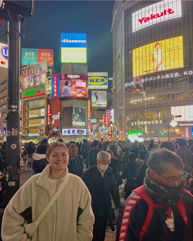

During her visit, Lauren gained exposure to several valuable laboratory techniques, including siRNA transfection, NF-κB immunofluorescence imaging, and FUCCI live cell cycle imaging of MCF-7 cells.
After her time in the Okada lab, Lauren took the bullet train to Tokyo for a few days holiday.

