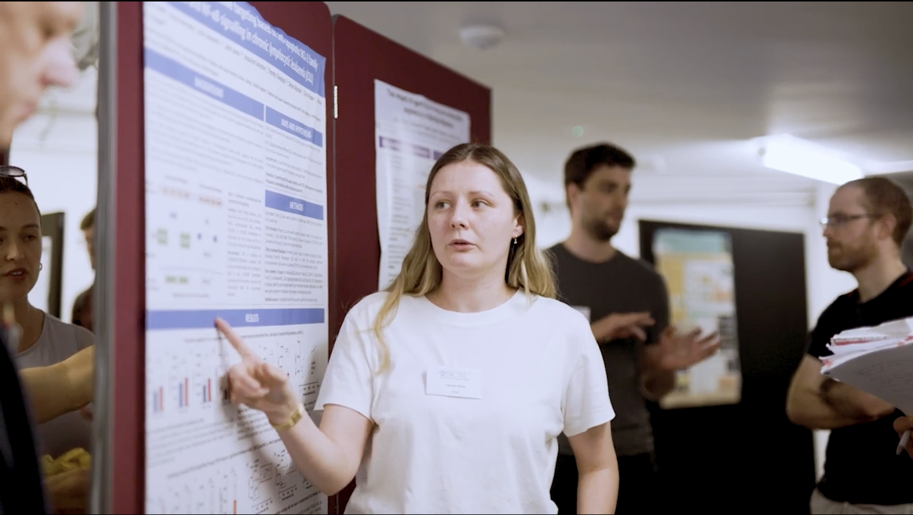

The centre is a groundbreaking collaborative venture enabling researchers, clinicians, and patients to share resources, insight, experience and expertise to improve cancer treatments and patient outcomes. The launch event was in June 2024, organised by our very own Gemma, and was a fantastic success with over 200 delegates.  

Alongside clinical and research talks, there were three outstanding presentations from patients entitled ‘The patient voice’.  These included very moving presentations from our collaborators the artist Markus Taylor and Dr Emma Taylor-Gallardo. We were delighted that Lauren won the best poster presentation alongside Ben Green, who is also a Blood Cancer Research PhD student working with our collaborator Dr John Jones.  

