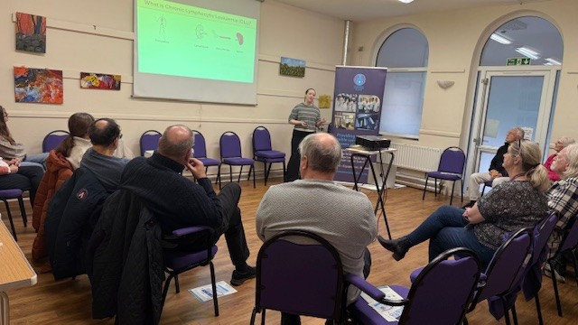

This is a meeting organised by the Sussex Cancer Fund (SCF) for those who have been affected by a blood cancer diagnosis. She was joined by Professor Mel Flint (University of Brighton), Alice Bourne (PhD Student, BSMS), and Gemma Hamilton (Study Coordinator, BSMS).

The meeting brought together people with lived experience of blood cancer, providing an opportunity to introduce the aims and design of the STRESS_CLL study and to get valuable input. The project will investigate the relationship between stress and both quality of life (QoL) and response to therapy in individuals with chronic lymphocytic leukaemia (CLL). Dr Kennedy highlighted the study’s approach, which includes the collection of saliva samples, blood samples and QoL questionnaires.

STRESS_CLL is a project that is joint-funded by the Sussex Cancer Fund and a BSMS20 PhD studentship award which Alice Bourne has recently started working on. It is an exciting collaboration between Professor Flint’s stress team at the University of Brighton, Dr Helena Harder from SHORE-C, Dr Kennedy and Professor Andrea Pepper from the CLL research team at Brighton and Sussex Medical School (BSMS) and Dr John Jones at both East Sussex Healthcare NHS Trust (ESHT) and BSMS. 

This engaging meeting helped strengthen links between the research team, SCF, and the lived-experience community as the project is launched.

