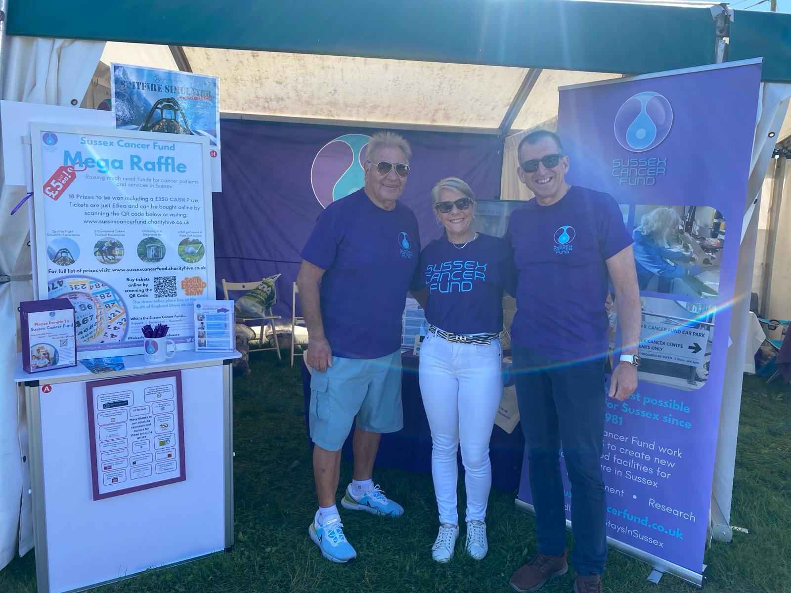
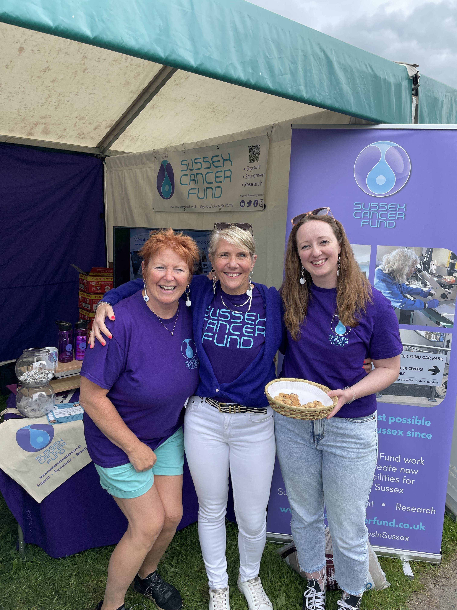

The event is a big annual event at the Ardingly showground located in the heart of Sussex and is attended by over 60,000 local people over the three days. It was an ideal opportunity for the charity to raise both awareness of their work and funds. Chris, Andrea, Emma and Simon (https://mitchell.science) enjoyed talking to local people and sharing our research. 

It was also lovely to meet members of the SCF (Irene and Colin) who work so tirelessly to raise funds for our local cancer charity. 

!
