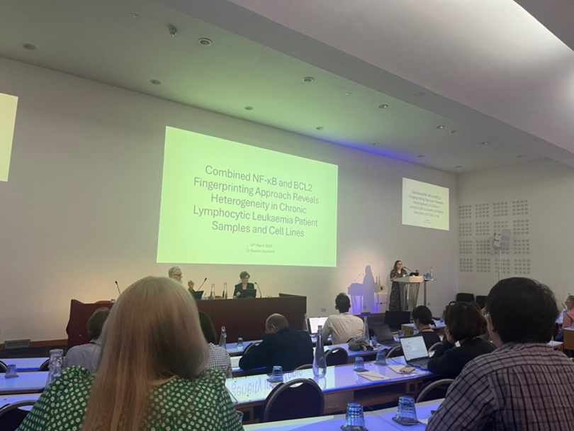
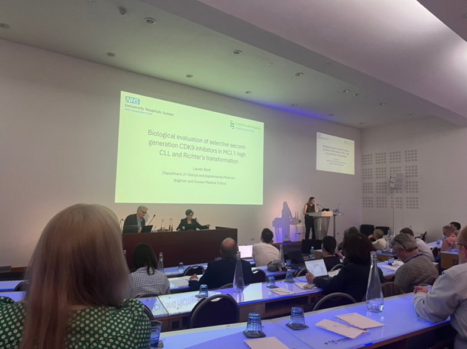

On Wednesday 18th March the UKCLL Forum annual scientific day (https://ukcllforum.org) was held in London and attended by members of the CLL team.

The conference had an excellent program and was attended of many of our collaborators enabling us to build on our collaborative research plans as well as enjoy some excellent presentations. The day concluded with the award of the Catovsky prize; an award established in 2006 by the UK CLL Forum in recognition of the outstanding contribution that Professor Daniel Catovsky made to the field of clinical and scientific CLL research. All non-tenured UK CLL researchers are invited to submit an abstract of their unpublished research work for consideration by the UK CLL Forum executive committee. There were 16 abstracts submitted and the standard was really high. The three highest scoring abstracts were selected for a 10-minute oral presentation at the meeting, and we were delighted that both Eleanor and Lauren from our team were chosen. 

Firstly Eleanor presented her research entitled ‘Combined NF-κB and BCL2 fingerprinting approach reveals heterogeneity in chronic lymphocytic leukaemia patient samples and cell lines’ followed by Lauren presenting her research entitled ‘Biological evaluation of selective second-generation CDK9 inhibitors in MCL1-high CLL and Richter’s transformation’. Both gave fantastic presentations and we were very proud of them both. 

Eleanor:

Lauren:

