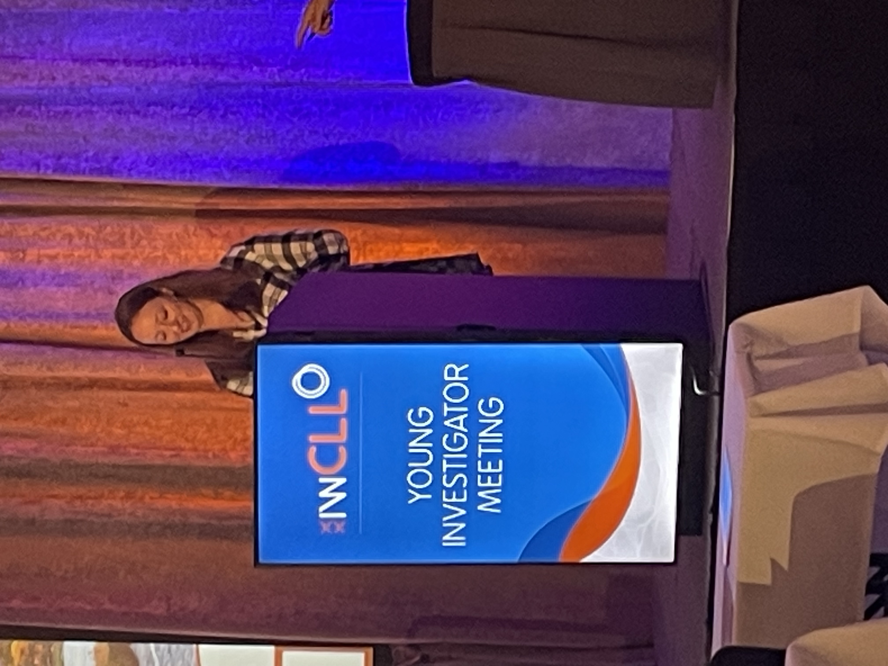
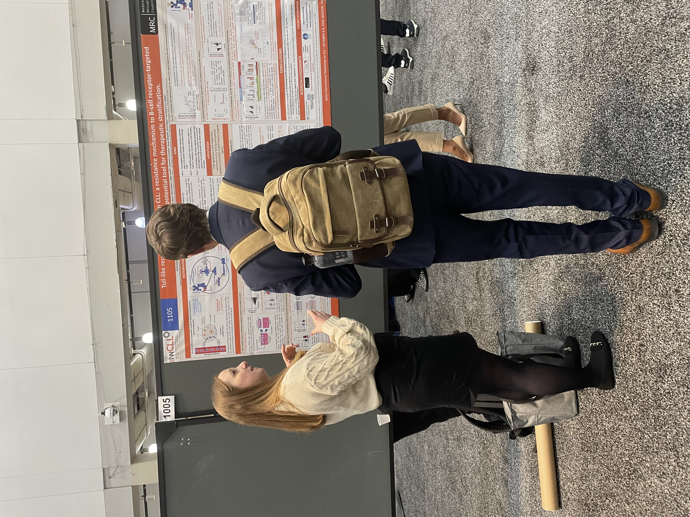

Dr Emma Kennedy won a prestigious travel scholarship and gave an oral presentation on her work entitled  ‘Toll-like receptor signalling in CLL; a resistance mechanism to B-cell targeted treatments and a potential tool for therapeutic stratification’. 

She also had a poster, which contained data generated by herself and PhD student Lauren Stott.

Clinical fellow Dr Iona Ashworth also had a poster entitled ‘Targeting NF-κB-inducing kinase (NIK) in chronic lymphocytic leukaemia’.

Both posters generated a huge amount of interest and the whole team came away from the conference with lots of new and exciting ideas.

The team ended the trip with a visit to Harvard University.

You can view Emma’s abstract [here.](<http://www.pepper.science/Emma Kennedy_iwCLL 2023 Abstract.pdf>)

You can view Iona’s abstract [here.](<http://www.pepper.science/iWCLL abstract- I Ashworth.pdf>)
