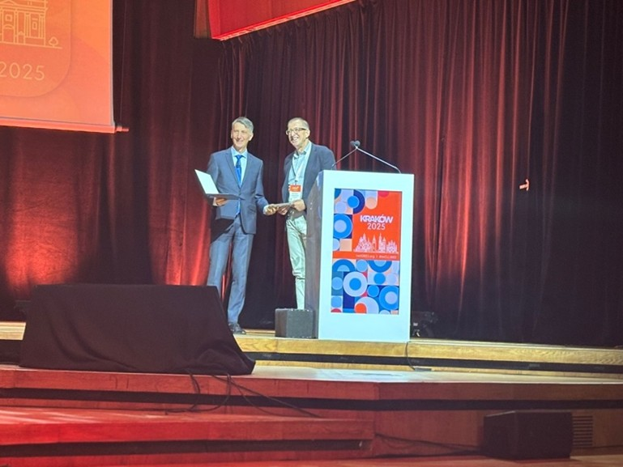
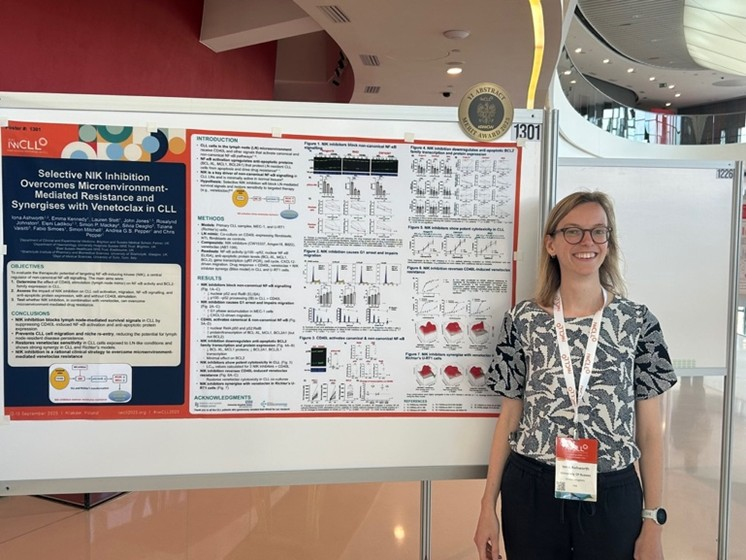
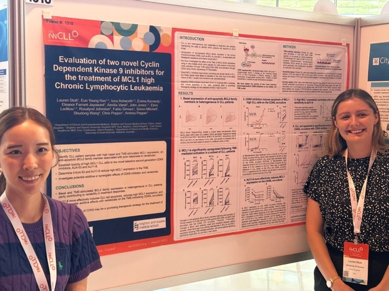
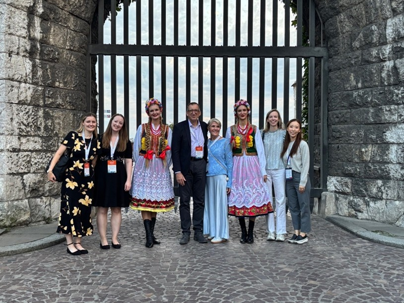

## Overview

The Blood Cancer Research Group from BSMS attended the 2025 International Workshop on Chronic Lymphocytic Leukaemia (iwCLL) held in Kraków, Poland. This prestigious international meeting brought together world-leading researchers and clinicians to discuss advances in the biology and treatment of CLL. The team were honoured to contribute four presentations—one oral and three posters—spanning several complementary themes centred on the targeting of NF-κB and microenvironmental survival pathways in CLL.
Our work was extremely well received, with Professor Chris Pepper’s abstract being awarded Top Ranked Abstract at the meeting—a tremendous and unexpected recognition of our group’s contribution to the field.

## Oral Presentation

**Targeted Degradation of NF-κB RelA/p65 by PBD-Based PROTACs as a Novel Therapeutic Strategy in CLL**

*Presenter:* *Professor* *Chris* *Pepper* 

NF-κB signalling remains aberrantly active in CLL, driving tumour cell survival and therapy resistance. Direct pharmacological inhibition has previously been limited by toxicity in normal immune cells. Professor Pepper presented new data describing the design and preclinical evaluation of a PBD-based PROTAC (JP-163-16) capable of selectively degrading the NF-κB subunit RelA/p65. This approach achieved potent, cereblon-dependent RelA depletion and CLL cell killing, while sparing other NF-κB family members. These results support targeted protein degradation as a promising therapeutic avenue for CLL.

## Poster Presentations 

**1. Selective NIK Inhibition Overcomes Microenvironment-Mediated Resistance and Synergises with Venetoclax in CLL**

*Presenter:* *Dr* *Iona* *Ashworth* *(PhD Student)* 

This poster described how the lymph node microenvironment promotes drug resistance via activation of canonical and non-canonical NF-κB pathways. Inhibiting NF-κB-inducing kinase (NIK) suppressed survival signals, reduced anti-apoptotic BCL2-family protein expression, and restored sensitivity to venetoclax. NIK inhibition also impaired CLL cell migration and showed synergy with venetoclax in both primary CLL and Richter’s models—supporting clinical development of NIK inhibitors to overcome microenvironment-driven resistance. 

**2. Evaluation of Two Novel Cyclin Dependent Kinase 9 Inhibitors for the Treatment of MCL1-High Chronic Lymphocytic Leukaemia**

*Presenters:* *Lauren Stott (PhD Student)* *and Anna (Eun Young Han; Academic Clinical Fellow)*

Lauren presented her PhD research evaluating two new selective CDK9 inhibitors (AU4-53 and AU11-8) as potential treatments for MCL1-high CLL, a subset known to resist venetoclax. These inhibitors induced apoptosis even under cytoprotective, lymph node-like conditions. The poster also included Anna’s exciting data showing that the inhibitors are potent downregulators of  MCL1 expression. Importantly, early data indicated synergy with venetoclax. This work supports further exploration of CDK9 inhibition to target MCL1-dependent CLL.
This was Lauren’s **first international presentation**, and she reported valuable discussions and feedback that will inform the next phase of her research.

**3. Toll-Like Receptor 9 Signalling as a Potential Tumour Escape Mechanism Following B-Cell Receptor Targeted Treatments in CLL**

*Presenter: Dr Emma Kennedy* 

Emma’s poster explored TLR9 signalling as a mechanism of resistance to BTK inhibitors such as ibrutinib. Using primary patient samples and migration assays, she identified subsets of CLL cases in which TLR9 activation enhanced cell migration even in the presence of BTK inhibition, suggesting a potential BTK-independent survival pathway. The study also linked TLR9 responsiveness with disease aggressiveness, proposing TLR9 as a biomarker for therapeutic stratification and a possible target for combination therapy.

## Welcome Reception 

The welcome reception was help at the beautiful Wawel Royal Castle where the team had an excellent opportunity to catch up with all their international collaborators. 

## Reflections and Acknowledgements

Attendance at IwCLL 2025 provided the BSMS team with an invaluable opportunity to showcase our ongoing translational research, connect with international collaborators, and gain expert feedback. For our junior researchers, it was an invaluable experience to present their work at a major international meeting—a key step in their academic development.
We are grateful to the UK CLL Forum for their generous financial support, which enabled our participation in this landmark meeting. The visibility and recognition our group received at IwCLL 2025 would not have been possible without this assistance.

