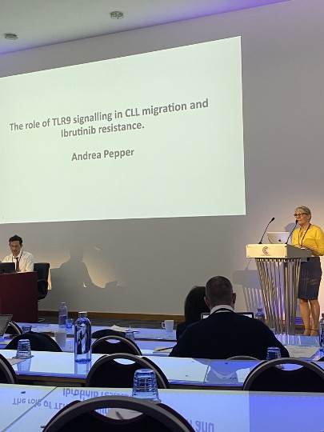
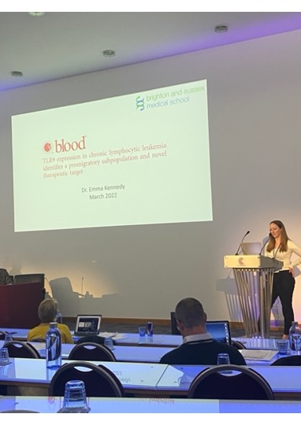
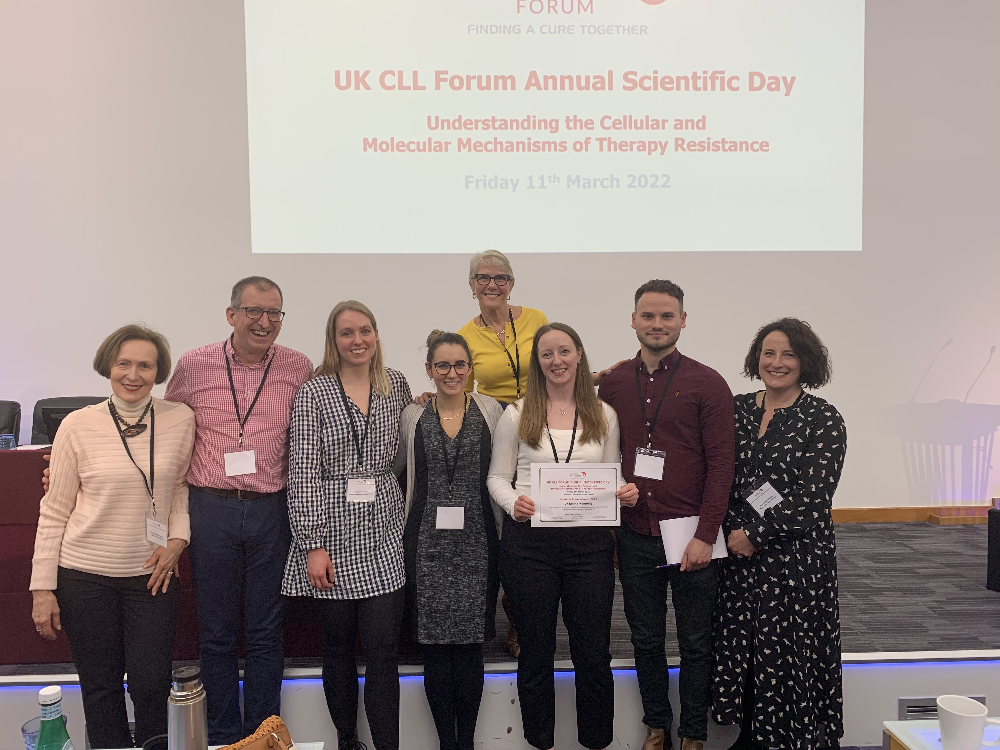

Andrea Pepper gave a keynote lecture entitled ‘The role of TLR9 signalling in CLL cell migration and Ibrutinib resistance’. In this lecture Andrea presented our most up to date results on TLR9 signalling in CLL and also some exciting new data generated by Tom Burley and Chris Pepper. This has recently been published in two back-to-back manuscripts in the journal ‘Cancers’.  

 At the meeting Emma Kennedy was awarded the Hamblin Prize for the best publication in 2021 by a UK based CLL research team and presented her manuscript entitled ‘TLR9 expression in chronic lymphocytic leukemia identifies a promigratory subpopulation and novel therapeutic target.’ A link to the slides for both talks are below: 

You can view Andrea’s slides here:

You can view Emma’s slides here: