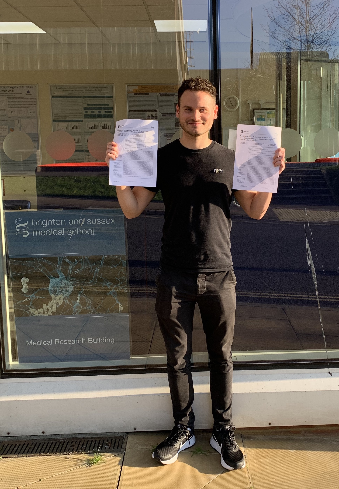

Tom Burley is shown here with his two first author manuscripts which were published back-to-back in a special edition of ‘Cancers’. The first manuscript is entitled ‘Elucidation of focal adhesion kinase (FAK) as a modulator of migration and invasion and as a potential therapeutic target in chronic lymphocytic leukemia’.  In this manuscript we demonstrate the importance of FAK in CLL migration and present data showing synergistic inhibition of CLL migration using Ibrutinib and the FAK inhibitor Defactinib. The second manuscript is entitled ‘Targeting the Non-Canonical NF-κB Pathway in Chronic Lymphocytic Leukemia and Multiple Myeloma’. In this manuscript we demonstrated that a novel NIK inhibitor, generated by our collaborator Professor Simon Mackay from the University of Strathclyde, is a potent inhibitor of both CLL migration and survival. Furthermore, we demonstrated that the inhibitor had the potential to sensitise previously drug-resistant tumour cells to current therapies. The Link to the two papers are here:

Elucidation of focal adhesion kinase (FAK) as a modulator of migration and invasion and as a potential therapeutic target in chronic lymphocytic leukemia:

Targeting the Non-Canonical NF-κB Pathway in Chronic Lymphocytic Leukemia and Multiple Myeloma:

